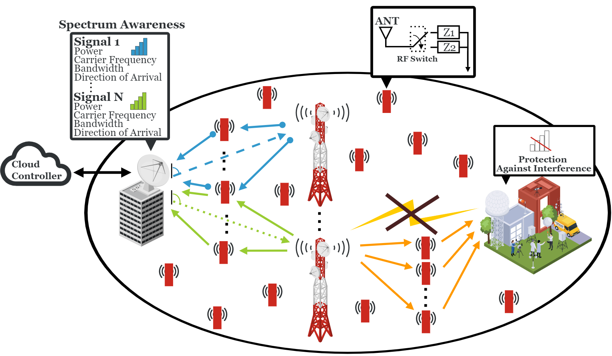

---
# Leave the browser tab title unchanged
title: ""  
date: 2022-10-24
type: landing

sections:
  - block: markdown
    content:
      title: ""
      text: |
        

          <h1 style="text-align: center;">EFFICIENT: Backscatter Fabric …</h1>
          
          
The next era of spectrum is envisioned to have spatially and spectrally adjacent systems that are dynamic, resulting in frequent cross-system interference. This project enables affordable, accurate, near-real-time spectrum situational awareness, including simple spectrum sensing algorithms, distributed mechanisms, and relevant spectrum sensing hardware. In addition, it targets mechanisms at the physical layer that provide radio waveform protection against unwanted interference without modifying existing infrastructure. Techniques include model-based and machine learning approaches, focusing on multidimensional awareness and interference protection. The work aims to demonstrate these principles in the FR3 band using the COSMOS Testbed for next-generation wireless coexistence scenarios.

          

            

              
              
National Science Foundation (NSF)

            

            

              
              
Wireless Information Network Laboratory (WINLAB)

            

          

        

    design:
      columns: 1

  - block: collection
    content:
      title: Recent Publications
      text: ""
      count: 5
      filters:
        folders:
          - publication
    design:
      view: citation
      columns: '1'

  - block: markdown
    content:
      title:
      subtitle:
      text: |
        {}
    design:
      columns: '1'
---
