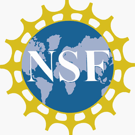

---
# Leave the browser tab title unchanged
title: ""  
date: 2022-10-24
type: landing

sections:
  - block: hero
    content:
      # Replace the top-left site title with an icon
      title: ''
      text: |
         
        
        
          
        BackscattEr FabrIC For MultidImensional
        SpEctrum SituatioNal AwarEness and ProTection
  
  - block: collection
    content:
      title: Recent Publications
      text: ""
      count: 5
      filters:
        folders:
          - publication
    design:
      view: citation
      columns: '1'

  - block: markdown
    content:
      title:
      subtitle:
      text: |
        {}
    design:
      columns: '1'
---
