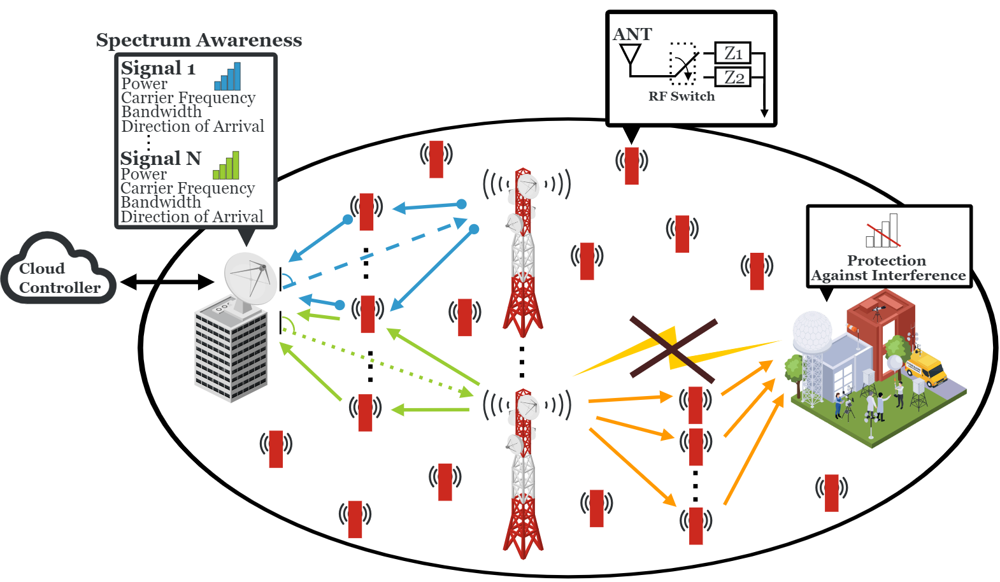
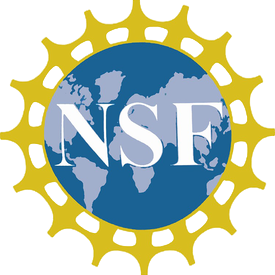

---
# Leave the browser tab title unchanged
title: ""  
date: 2022-10-24
type: landing

sections:
  - block: markdown
    content:
      title: ""
      text: |
        

          <!-- Title -->
          <h1 style="text-align: center; margin-bottom: 30px; font-size: 2.5em;">
            EFFICIENT: Backscatter Fabric For Multidimensional Spectrum Situational Awareness and Protection
          </h1>

          <!-- Image (matches text width, responsive) -->
          

            
          

          <!-- Text -->
          

            Funded by the National Science Foundation under Award No. 
            <a href="https://www.nsf.gov/awardsearch/show-award/?AWD_ID=2433991&HistoricalAwards=false" target="_blank">
              2433991
            </a>,  this project explores the next era of spectrum, which is envisioned to have spatially and spectrally adjacent systems that are dynamic, resulting in frequent cross-system interference effects. A desired aspect of this vision and spectrum management, is to empower these systems to be able to autonomously adapt and optimize their transmissions and receptions. Mechanisms used in the current and past eras of spectrum management, such as cloud-based spectrum access systems (SAS), spectrum servers, cognitive radio primary/secondary coexistence, cooperative relay networks, multiuser-multiple input multiple output (MU-MIMO) systems, or more recently, reconfigurable intelligent surface (RIS)-assisted networks, have all run up against limitations owing to the cost and potential lack of scalability of such solutions. What is required is affordable, accurate, near-real-time spectrum situational awareness, including simple spectrum sensing algorithms, distributed mechanisms, limited channel state information (CSI) estimation overhead and relevant spectrum sensing hardware. Further, using such near-real-time spectrum situational awareness to devise mechanisms at the physical layer that provide some form of radio waveform protection against malicious or unwanted interference would be even better.

            To this end, the proposed research project develops affordable, accurate, near-real-time spectrum situational awareness to the changing environment using a fabric of backscatter radios. The spectrum situational awareness afforded by the backscatter fabric (e.g. signal powers, carrier frequencies, bandwidths and directions of arrivals of transmissions in a given spatial area) can be used to address the near-real-time spectrum usage information needed for facilitating different spectrum management regimes. The same fabric of backscatter radios can also be used to provide spectrum protection by actively canceling out interfering transmissions from both legitimate and malicious transmitters.
          

          <!-- Logos side by side, responsive -->
          

            

              <a href="https://www.nsf.gov/awardsearch/show-award?AWD_ID=2433991/" target="_blank">
              
              
National Science Foundation (NSF)

            

            

              <a href="https://soe.rutgers.edu/" target="_blank">
              
              
Rutgers - New Brunswick School of Engineering

            

            

              <a href="https://winlab.rutgers.edu/" target="_blank">
              
              
Wireless Information Network Laboratory (WINLAB)

            

          

        

    design:
      columns: 1

  - block: collection
    content:
      title: Recent Publications
      text: ""
      count: 5
      filters:
        folders:
          - publication
    design:
      view: citation
      columns: '1'

  - block: markdown
    content:
      title:
      subtitle:
      text: |
        {}
    design:
      columns: '1'
---
